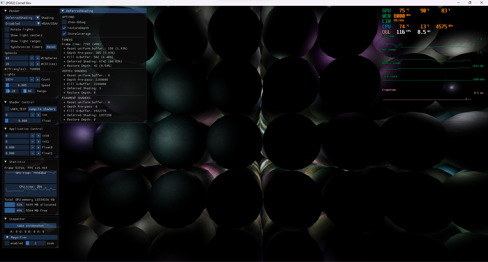

A university project implementing the paper "Deferred attribute interpolation for memory-efficient deferred shading" by Christoph Schied and Carsten Dachsbacher [[doi:10.1145/2790060.2790066](https://doi.org/10.1145/2790060.2790066)] using C++ and OpenGL.

